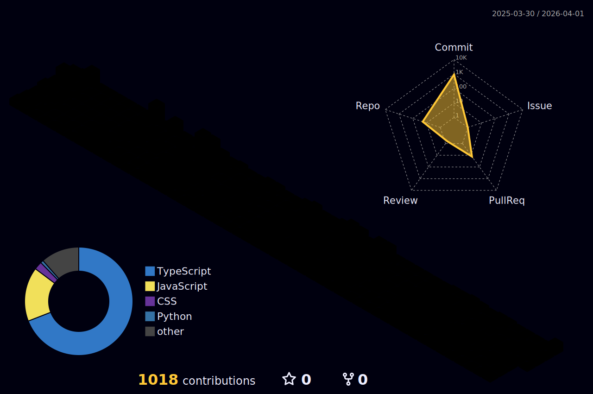

  
  
  
  
  
  
  
  
    

  <h1 align="center">
    Yo! 👋, I'm Rajesh Ranjan !
     
    👨‍💻 – exploring code like it’s uncharted space 🚀</h1>
  

    
  

  <h3 align="center">💻 Full Stack Developer @Business Today Technology | India Today Group | Ex-NTT 💻 
  🚀 Next.js | React.js | Node.js | React Native | JavaScript | TypeScript | Express.js | MongoDB | MySQL 🚀 
  🛠️ Building scalable web & cloud solutions with clean, performant code 🛠️</h3>

# 💫 About Me:

  
  
  
&nbsp;

  💻 Full Stack Developer @Business Today Technology | India Today Group | Ex-NTT  
  ⚡ Certified with React JS Development by GeeksForGeeks  
  ⚡ Certified with MERN Full Stack Web Development by GeeksForGeeks  
  💬 Ask me about **Next JS, React JS, Node JS, Express JS, JavaScript, TypeScript, React Native, MongoDB, MySQL**  
  📫 Reach me at : rajeshranjan@gmail.com  
  📫 Call me at : +91-999-934-0771  
  📄 Know about me (Portfolio) : https://rajesh-ranjan-portfolio.netlify.app/  
  📄 Resume : https://drive.google.com/file/d/1i57BJ4Zp61cIREahhDu-HEPkcNZ6X1AE/view?usp=sharing  
  🌱 React JS Certification Link : https://media.geeksforgeeks.org/courses/certificates/b93b9e18acf8cfe7685efe662e76ef77.pdf  
  🌱 MERN Full Stack Web Development Certification Link : https://media.geeksforgeeks.org/courses/certificates/cd5821e65eb73895ef125b8cec818f83.pdf

  <h1 align="center">👀 Profile Metrics</h1>

  
  
     •  • 
     
  

  <h1 align="center">🏆 GitHub Trophies</h1>

  

    
  

  

    
    
    
  

  <h1 align="center">👋 Socials</h1>

  

    
    
    
    
    
    
  

  <h1 align="center">💻 Tech Stack</h1>

  

             

  
  
  
  
  
    
  
    
  
    
     
    
    
   
   
   

 

  <h1 align="center">📊 GitHub Stats</h1>

  
 
    
     
     
    
  

  

    
  

  

  <h1 align="center">🔝 Top Contributed Repo</h1>

  

    
  

#

  

    
    <h1 align="center"><code>📊 𝙶𝚒𝚝𝙷𝚞𝚋 𝙼𝚎𝚝𝚛𝚒𝚌𝚜</code></h1>
  

  

    
  

<picture>
  <source media="(prefers-color-scheme: dark)" srcset="https://raw.githubusercontent.com/rajesh-ranjan-git/rajesh-ranjan-git/main/github-contribution-grid-snake-dark.svg">
  <source media="(prefers-color-scheme: light)" srcset="https://raw.githubusercontent.com/rajesh-ranjan-git/rajesh-ranjan-git/main/github-contribution-grid-snake.svg">
  
</picture>

  <h1 align="center">😂 Here is a random joke that'll make you laugh!</h1>

  

  
  

  <h1 align="center">
    Connect With Me
    
  </h1>

  

     
    <a href="https://github.com/rajesh-ranjan-git" target="_blank">
      <code></code>
    </a>
    <a href="https://linkedin.com/in/rajesh-ranjan-660b1b13a" target="_blank">
      <code></code>
    </a>
    <a href="https://twitter.com/_rajesh____" target="_blank">
      <code></code>
    </a>
    <a href="https://www.instagram.com/_rajesh____" target="_blank">
      <code></code>
    </a>
    <a href="https://fb.com/rajeshranjan8271" target="_blank">
      <code></code>
    </a>
    <a href="mailto:rajeshranjan8271@gmail.com">
      <code></code>
    </a>     
  

### 𝚂𝚑𝚘𝚠 𝚜𝚘𝚖𝚎 ❤️ 𝚋𝚢 𝚜𝚝𝚊𝚛𝚛𝚒𝚗𝚐 𝚜𝚘𝚖𝚎 𝚘𝚏 𝚝𝚑𝚎 𝚛𝚎𝚙𝚘𝚜𝚒𝚝𝚘𝚛𝚒𝚎𝚜!

#

