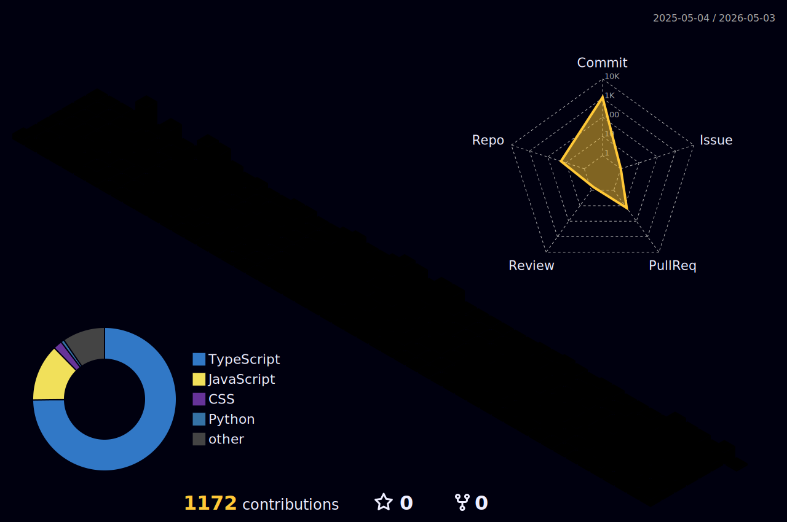

[](https://rajesh-ranjan-portfolio.netlify.app/)

<div align="center">
  
  [](https://rajesh-ranjan-portfolio.netlify.app/)
  [](https://github.com/rajesh-ranjan-git/)
  [](https://leetcode.com/rajesh_leetcode_handle/)
  [](https://linkedin.com/in/rajesh-ranjan-660b1b13a/)
  [](https://twitter.com/_rajesh____/)
  [](https://fb.com/rajeshranjan8271/)
  [](https://instagram.com/_rajesh____/)
    
</div>

<div>

  <h1 align="center">
    Yo! 👋, I'm Rajesh Ranjan !
  </h1>
  
  <h3 align="center">
    👨‍💻 – exploring code like it’s uncharted space 🚀
  </h3>

  <p align="center">
    <a href="https://github.com/DenverCoder1/readme-typing-svg"></a>
  </p>
  
  <h3 align="center">💻 Full Stack Developer @Business Today Technology | India Today Group | Ex-NTT 💻<br>
  🚀 Next.js | React.js | Node.js | React Native | JavaScript | TypeScript | Express.js | MongoDB | MySQL 🚀<br>
  🛠️ Building scalable web & cloud solutions with clean, performant code 🛠️</h3>

</div>

<div>

  <h1 align="center">🧠 About the Human Behind the Code</h1>

<a href="https://app.daily.dev/rajeshranjandevcard"></a>

  <div>&nbsp;</div>

💻 Full Stack Developer @Business Today Technology | India Today Group | Ex-NTT<br><br>
📢 Full Stack Developer with 6+ years of experience building scalable, high-performance web applications using React, Next.js, Node.js, TypeScript, and cloud-native technologies. Experienced in designing real-time systems, AI-powered content pipelines, and production-grade architectures with strong focus on performance optimization, scalability, and developer experience. Skilled in modern frontend architecture, backend systems, DevOps workflows, and AWS-based deployments.<br><br>
💬 Ask me about **Next JS, React JS, Node JS, Express JS, JavaScript, TypeScript, React Native, MongoDB, MySQL**<br><br>
📫 Reach me at : rajeshranjan@gmail.com<br><br>
📫 Call me at : +91-999-934-0771<br><br>
📄 Know about me (Portfolio) : [https://rajeshranjan.dev](https://rajeshranjan.dev)<br><br>
📄 Resume : [https://drive.google.com/file/d/1i57BJ4Zp61cIREahhDu-HEPkcNZ6X1AE/view?usp=sharing](https://drive.google.com/file/d/1otpwV4ktAwP-DMi8xBHj0ikCfMB22coU/view?usp=drive_link)<br><br>

</div>

<div>

```javascript
const rajeshRanjan = {
  currentRole: "Full Stack Developer @ India Today Group",

  education: "B.Tech in Computer Science & Engineering",

  experience:
    "6+ years of experience building scalable full-stack applications, real-time systems, and performance-driven web platforms",

  workingOn:
    "Building and optimizing high-traffic media platforms at Business Today Technology (India Today Group) with focus on scalable architecture, AI-powered content systems, SEO optimization, real-time analytics, and modern full-stack engineering",

  specialties: [
    "Full Stack Development",
    "Scalable Web Architecture",
    "Real-time Applications",
    "AI-powered Workflows",
    "Performance Optimization",
    "SEO & Core Web Vitals",
    "Modern Frontend Engineering",
    "Cloud & DevOps",
  ],

  techStack: {
    frontend: [
      "React.js",
      "Next.js",
      "TypeScript",
      "Tailwind CSS",
      "TanStack Query",
      "Redux",
      "React Native",
    ],

    backend: [
      "Node.js",
      "Express.js",
      "REST APIs",
      "GraphQL",
      "WebSockets",
      "Socket.IO",
    ],

    databases: ["MongoDB", "PostgreSQL", "MySQL", "Redis"],

    cloudAndDevOps: [
      "AWS",
      "EC2",
      "Cloudflare",
      "Nginx",
      "PM2",
      "GitHub Actions",
      "CI/CD",
    ],

    aiAndData: ["OpenAI APIs", "NLP Pipelines", "Python", "Transformer Models"],
  },

  currentFocus:
    "Designing production-grade full-stack applications with modern frontend architecture, scalable backend systems, AI integrations, and real-time communication workflows using Next.js, React, Node.js, TypeScript, WebSockets, and AWS infrastructure",

  building: [
    "DevMatch — Real-time developer networking platform",
    "AI-powered content analysis systems",
    "Scalable media-tech platforms",
  ],

  funFact:
    "I enjoy architecting scalable systems just as much as solving complex DSA and LeetCode problems — whether it's optimizing Core Web Vitals, designing real-time architectures, or debugging production issues at 2 AM 🚀",
};
```

</div>

<div>

  <h1 align="center">🧮 GitHub Profile Analytics</h1>

  <p align="center">  
     •  • 
     
  </p>

  <p align="center">
    
  </p>

</div>

<div>

  <h1 align="center">🏆 Achievements Unlocked</h1>

  <p align="center" style="width:100%">
    
  </p>

  <p align="center" >
    
    
    
  </p>

</div>

<div>

  <h1 align="center">📈 Developer Dashboard</h1>

  <p align="center">
    
  </p>

  <p align="center">
    
    
  </p>

  <p align="center">
    
    
  </p>

  <p align=center>
    
  </p>

  <p align=center>
    
  </p>

</div>

<div>

  <h1 align="center">🎯 Profile Contributions 3D</h1>



</div>

<div align="center">

# 💼 Professional Experience </div>

## 👨‍💻 Full Stack Developer — Business Today Technology (India Today Group)

📍 April 2025 – Present

⚙️ Next.js • React.js • Node.js • TypeScript • Python • MongoDB • PostgreSQL • Redis • AWS

- 🚀 Re-architected distributed Python services into a scalable Next.js-based system, reducing infrastructure complexity and improving maintainability.
- 🤖 Built AI-powered content analysis pipelines using OpenAI APIs and NLP models to process and analyze 500,000+ news articles.
- ⚡ Optimized SEO performance and Core Web Vitals using SSR, caching strategies, and dynamic rendering, reducing page render time from 3.7s to 1.5s.
- 🔌 Developed scalable REST APIs, request tracking systems, and backend optimizations that reduced unnecessary API traffic by 40%+.
- ☁️ Improved deployment workflows and cloud infrastructure efficiency, significantly reducing deployment times and operational overhead.
- 📊 Built real-time Google Trends analytics dashboards with polling-based live data visualization systems.
- 🔄 Led migration from Next.js 12 to Next.js 15 while resolving multiple security vulnerabilities and improving application stability.
- 🤝 Collaborated across product, backend, and frontend teams in Agile development workflows while contributing to architectural planning and feature delivery.

## 📱 React Native Developer — CyberEd (Part-Time Internship)

📍 Feb 2025 – Mar 2025

⚙️ React Native • Expo • TypeScript • Push Notifications

- 📲 Built reusable React Native UI components to accelerate feature development and improve maintainability.
- 🎨 Resolved multiple responsiveness and layout issues across devices to improve user experience and mobile compatibility.
- 🔔 Implemented push notification systems for learning reminders and engagement workflows.
- ⚡ Contributed to OTA update workflows using Expo, enabling seamless updates without requiring Play Store releases.
- 🤝 Collaborated with developers and stakeholders in an Agile environment to debug issues and improve application stability.

## 🧑‍💻 UI Developer — NTT DATA Services

📍 Nov 2020 – Apr 2025

⚙️ React.js • JavaScript • TypeScript • MongoDB

- 🧩 Developed reusable React components and scalable frontend modules for enterprise applications.
- 📊 Built statistical dashboards for Banking and Education domains with interactive data visualizations.
- 📈 Integrated HighCharts-based analytics systems for dynamic reporting and insights.
- ⚡ Improved frontend performance and responsiveness by replacing heavy third-party UI libraries with optimized custom solutions.
- 🤝 Worked closely with cross-functional teams to deliver scalable and maintainable UI systems.

<div>

  <h1 align="center">🔧 Gears Behind the Code</h1>

  

</div>

<div>

  
  
  
  
  
  
  
  
  
  
  
  
  
  
  
  
  
  
  
  
  
  
  
  
  
  
  
  
  
  
  
  
  
  
  
  
  
  
  
  
  
  
  
  
  
  
  
  
  
  
  
  
  
  
  
  
  
  
  
  
  
  
  
  
  
  
  
  
  
  
  
  
  
  
  
  
  

</div>

<div>&nbsp;</div>

<div align="center">

### 💻 Languages & Core


![Java](https://img.shields.io/badge/java-FFFFFF.svg?style=for-the-badge&logo=&logoColor=white)


### 🎨 Frontend Mastery


![CSS](https://img.shields.io/badge/css-0277BD.svg?style=for-the-badge&logo=&logoColor=white)


### ⚙️ Backend & Infrastructure


![Java](https://img.shields.io/badge/java-FFFFFF.svg?style=for-the-badge&logo=&logoColor=white)


### 🗄️ Databases


![Oracle](https://img.shields.io/badge/oracle-FF0000.svg?style=for-the-badge&logo=&logoColor=white)

### ☁️ DevOps & Cloud


</div>

<div align="center">

# 🏗️ Featured Personal Projects </div>

## 💬 DevMatch — Developer Networking Platform

[](https://github.com/rajesh-ranjan-git)

[](https://devmatch.rajeshranjan.dev)

Production-grade developer networking platform focused on real-time communication and scalable full-stack architecture.

### 🚀 Key Features

- ⚡ Real-time messaging with Socket.IO
- 🔐 JWT + OAuth with RBAC authentication system
- 👥 User discovery and notifications
- 📡 Online presence, typing indicators & read receipts
- 🧩 Modular backend architecture with centralized error handling
- ☁️ AWS EC2 deployment with Nginx, PM2 & Cloudflare
- 🔄 Automated CI/CD pipelines using GitHub Actions
- 📧 AWS SES transactional email workflows
- 🎨 Optimized frontend architecture using React Server Components & TanStack Query

### 🛠️ Tech Stack

- 🎨 Frontend: Next.js, TypeScript, Tailwind CSS, Zustand, TanStack Query, Motion (formerly Framer Motion)
- 🛠️ Backend: Node.js, Express.js
- 🗄️ Database: MongoDB
- 🔐 Authentication: JWT, OAuth (Google, GitHub, LinkedIn)
- ⚡ Real Time System: Socket.IO
- 📨 Mailing System: Amazon SES
- ☁️ Deployment: Amazon EC2, AWS, Cloudflare, Nginx, PM2

## 🛍️ Shopprixity — Full Stack E-Commerce Platform

[](https://github.com/rajesh-ranjan-git/Shopprixity)

[](https://shopprixity.vercel.app)

Modern e-commerce platform featuring authentication, product management, cloud media handling, and payment integrations.

### 🛠️ Tech Stack

- 🎨 Frontend: React.js, Tailwind CSS, Vite
- 🛠️ Backend: Node.js, Express.js
- 🗄️ Database: MongoDB, Prisma
- 🔐 Authentication: Firebase + JWT
- 💳 Payments: PayPal
- ☁️ Deployment: Vercel

## 💳 BancardifyMe — Modern Banking Platform

[](https://github.com/rajesh-ranjan-git/bancardifyme)

[](https://bancardifyme.netlify.app)

Multi-banking platform focused on secure financial workflows, authentication systems, and responsive dashboard architecture.

### 🛠️ Tech Stack

- 🎨 Frontend: Next.js, TypeScript, Tailwind CSS
- 🛠️ Backend: Node.js, Express.js
- 🗄️ Database: Appwrite
- 🔐 Authentication: Firebase + Appwrite
- 💳 Integrations: Plaid + Dwolla
- 📊 Monitoring: Sentry
- ☁️ Deployment: Netlify

## 🎬 MovieMania — Movie Discovery Platform

[](https://github.com/rajesh-ranjan-git/MovieMania)

[](https://moviemania-platform.netlify.app)

Dynamic movie and TV show browsing platform with responsive UI and modern frontend architecture.

### 🛠️ Tech Stack

- 🎨 React.js + Tailwind CSS
- ⚡ Vite
- 📦 Lucide React
- ☁️ Netlify Deployment

<div>

  <h1 align="center">🎯 Ongoing Priorities & Aspirations</h1>

```yaml
🔭 Professional Goals:
  - Building scalable and high-performance digital media platforms at Business Today Technology (India Today Group)
  - Enhancing SEO, Core Web Vitals, accessibility, and overall user experience across large-scale web applications
  - Designing production-grade architectures with focus on scalability, maintainability, and developer experience
  - Expanding expertise in AI-powered workflows, real-time systems, and cloud-native applications

🔬 Learning & Development:
  - Advanced System Design & Distributed Architecture
  - Scalable backend systems and event-driven architectures
  - Cloud infrastructure, DevOps, and deployment automation
  - Performance optimization for high-traffic applications
  - AI integrations, NLP pipelines, and modern data workflows
  - Modern frontend rendering strategies and web performance optimization

🤝 Collaboration Interests:
  - Full-stack web applications and scalable SaaS platforms
  - Real-time applications and developer-focused tools
  - Open-source contributions and community-driven projects
  - AI-powered products and modern web engineering workflows
  - Frontend architecture, developer experience, and performance engineering
```

</div>

<div align="center">

  <h1 align="center">💡 Development Philosophy</h1>

_"Any fool can write code that a computer can understand. Good programmers write code that humans can understand."_


</div>

<div>
  <h1 align="center">🧭 Contributor Stats</h1>

  <p align="center">
    <a href="https://metrics.lecoq.io/about/rajesh-ranjan-git">
      
    </a>
  </p>

</div>

<div>

  <h1 align="center">🐍 Activity Anaconda</h1>

  <picture>
    <source media="(prefers-color-scheme: dark)" srcset="/snake-commit-contribution/github-snake-dark.svg" />
    <source media="(prefers-color-scheme: light)" srcset="/snake-commit-contribution/github-snake.svg" />
    
  </picture>

</div>

<div>

  <h1 align="center">😂 Here is a random joke that'll make you laugh!</h1>

  <p align="center">
    
  </p>

</div>

<div>

  <h1 align="center">
    🛸 Beam Me a Message
    
  </h1>

  <p align="center">
    <br>
    <a href="https://github.com/rajesh-ranjan-git" target="_blank">
      <code></code>
    </a>
    <a href="https://linkedin.com/in/rajesh-ranjan-660b1b13a" target="_blank">
      <code></code>
    </a>
    <a href="https://twitter.com/_rajesh____" target="_blank">
      <code></code>
    </a>
    <a href="https://www.instagram.com/_rajesh____" target="_blank">
      <code></code>
    </a>
    <a href="https://fb.com/rajeshranjan8271" target="_blank">
      <code></code>
    </a>
    <a href="mailto:rajeshranjan8271@gmail.com">
      <code></code>
    </a>
  </p>

</div>

<div align="center">

### 🚀 "Code, Create, Contribute."

**Shaping the future — one commit at a time! ⭐**

### Thanks for stopping by! Show some ❤️ by starring some of my repositories!

</div>

#


