<!-- 

 
 
 -->

<h1 align="center">Hi 👋, I'm Rajesh Ranjan</h1>
<h3 align="center">An enthusiastic Full Stack Web Developer adept at leveraging a diverse skill set trying. Certified with MERN Full Stack Web Development at GeeksForGeeks. Proficient in ReactJS, JavaScript, Node.js, MongoDB, ExpressJS, Python, and Java with an inclination towards delivering dynamic and user-friendly web applications.</h3>

# 💫 About Me:

⚡ Certified with React JS Development by GeeksForGeeks  
⚡ Certified with MERN Full Stack Web Development by GeeksForGeeks  
💬 Ask me about **MERN, React JS, Node.js, ExpressJS, JavaScript, MongoDB**  
📫 Reach me at : rajeshranjan@gmail.com  
📫 Call me at : +91-999-934-0771  
📄 Know about my experiences (Resume Link) : https://www.linkedin.com/in/rajesh-ranjan-660b1b13a/overlay/1723087518869/single-media-viewer/?profileId=ACoAACH7QugBEDs8g99PDcJo7iH_R0nlppK50Gk  
📄 Git Resume Link : https://github.com/rajesh-ranjan-git/rajesh-ranjan-git/blob/main/Rajesh_Resume.pdf  
🌱 React JS Certification Link : https://media.geeksforgeeks.org/courses/certificates/b93b9e18acf8cfe7685efe662e76ef77.pdf  
🌱 MERN Full Stack Web Development Certification Link : https://media.geeksforgeeks.org/courses/certificates/cd5821e65eb73895ef125b8cec818f83.pdf

 
 
 

  
   •   
  <!--  • -->
   •
   

<h1 align="center">👋 Socials</h1>

 

<h1 align="center">💻 Tech Stack</h1>

             

 
 
  

  
 

  

 

  
   
   
  
  
  
  
  
 

  
 

 

# 📊 GitHub Stats:

  
  
  

 

 

## 🏆 GitHub Trophies

  

 

## 🏆 GitHub Trophies

### 🔝 Top Contributed Repo

---

#

    
  <h4 align="center"><code>📊 𝙶𝚒𝚝𝙷𝚞𝚋 𝙼𝚎𝚝𝚛𝚒𝚌𝚜</code></h4>

 

## 😂 Here is a random joke that'll make you laugh!

<h1>
  Connect With Me
  
</h1>

   
  <a href="https://www.linkedin.com/in/pranav-choudhary/" target="_blank">
    <code></code>
  </a>
  <a href="https://stackoverflow.com/users/10224590/pranav-choudhary/" target="_blank">
    <code></code>
  </a>
  <a href="https://www.instagram.com/pranav.elric" target="_blank">
    <code></code>
  </a>
  <a href="https://dev.to/pranavelric" target="_blank">
    <code></code>
  </a>
  <a href="mailto:pranavchoudhary500@gmail.com">
    <code></code>
  </a>     

 
 

### 𝚂𝚑𝚘𝚠 𝚜𝚘𝚖𝚎 ❤️ 𝚋𝚢 𝚜𝚝𝚊𝚛𝚛𝚒𝚗𝚐 𝚜𝚘𝚖𝚎 𝚘𝚏 𝚝𝚑𝚎 𝚛𝚎𝚙𝚘𝚜𝚒𝚝𝚘𝚛𝚒𝚎𝚜!

#

